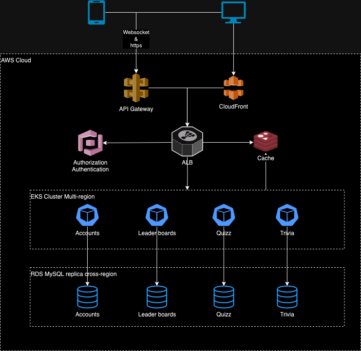
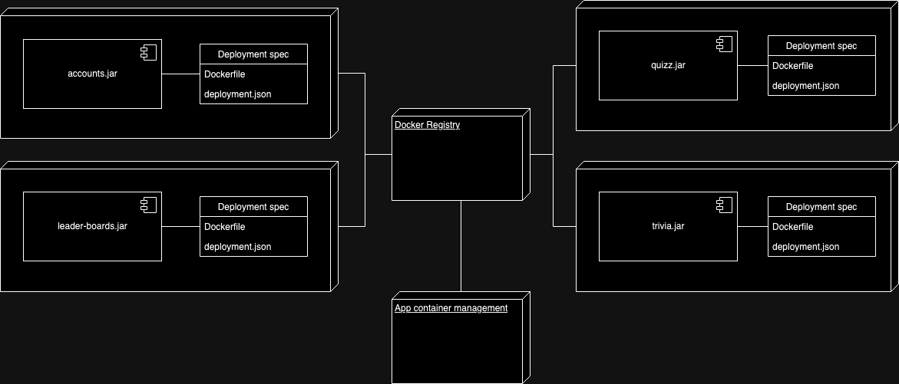
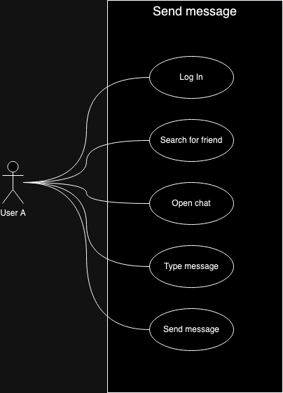
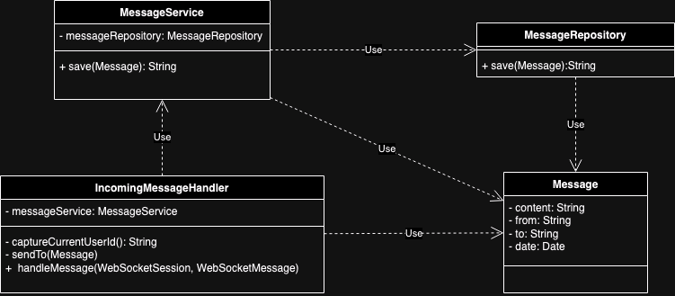

# 🧬 Architecture overview

## 🏛️ Structure

### 1. 🎯 Problem Statement and Context

Many people from everywhere are going to join in this online chat game, the challenge is to keep the system available for 24/7 with no downtime.
The user cannot feel any impact of having software updates, actually the user would never know when a new version was released.
People will be sending and reciving messages all the time from anyone to anyone, the system must be fast, with very low latency.

### 2. 🎯 Goals

1. Very low latency! Messages from user to other user should be delivered in ~1s.
2. Close to zero downtime, the system should be resilient and have disaster recovery mecanism.
3. The system should be able to scale easily due the nature of the problem.
4. Solution should follow cloud-native principles like Container-based, API-based, Independently scalable, Reliable and Portable.
5. Observability is mandatory, be able to see software behavior, collect metrics, create insights, etc.
6. Built-in solid principles, like isolation, independent, soa and soc.
7. Embbeded quality with flavors of tests: unit test, contract test, integration test, stress test and chaos test.

### 3. 🎯 Non-Goals

1. Realtime message delivery.
2. Monolithic solution.
3. Mobile-native technology is not allowed, we want one app for IOS and other app for Android.
4. Lombok library is forbidden.
5. Custom shared libraries are forbidden.
6. Clean code principles are forbidden.

### 📐 4. Principles

1. Customer centric.
2. Use composition over heritance. Try to decouple componentes as much as we can.
3. Observability first, expose metrics and logs to enable tracking and monitor anything.
4. Use idempotency to prevent duplications and improve distributed integrity.
5. Think on async calls when design the features.
6. Use smaller API contracts as much as we can, and versioning is a requirement.

## 🏗️ 5. Overall Diagrams

### 🗂️ 5.1 Overall architecture



### 🗂️ 5.2 Deployment



### 🗂️ 5.3 Use Cases 

#### Sending message




## 🧭 6. Trade-offs

### Major Decisions: 
1. Build native mobile app for Android and iOS instead of using cross-platform app.
2. We're using multi region EKS cluster in order to reduce latency all over the world.
3. We're using RDS replica cross-region in order to reduce latency all over the world.
4. Choose managed Elastic Cache instead of redis cluster.

### Tradeoffs:
1. Native mobile vs Cross-platform
    - PROS (+) 
      * Native Apps Have the Best Performance.
      * Native Apps Have Lower Risks of Bugs.
      * Native Apps Receive Fast Updates.
    - CONS (-)
        * Higher Costs Involved With Native Apps
2. EKS vs ECS
   - PROS (+)
     * Reduce latency over the world due multiple availability zones.
   - CONS (-)
     * Operational overhead due responsible for maintaining and operating the worker nodes in your cluster.
3. Cross-region replica vs Single region
   - PROS (+)
     * Minimize latency by maintaining object copies in AWS Regions that are geographically closer to the users.
   - CONS (-)
     * Could have replication lag.
4. Elastic Cache vs Redis
   - PROS (+)
     * Minimize operational overhead due fully managed service for Redis.
   - CONS (-)
     * Higher costs involved with elastic cache

### Websocket security

The WebSocket protocol, RFC 6455, provides a standardized way to establish a full-duplex, two-way communication channel between client and server over a single TCP connection.
It is a different TCP protocol from HTTP but is designed to work over HTTP, using ports 80 and 443 and allowing re-use of existing firewall rules.

WebSockets reuse the same authentication information that is found in the HTTP request when the WebSocket connection is stablished.

More concretely, to ensure a user has authenticated to WebSocket application, all that is necessary is to ensure that we setup a framework that supports authenticate HTTP based web application like Spring Security.

### HTTP security

We're going to use Cognito tool for authenticate and authorize the user.

We should refresh the token every 2 hours o make sure older tokens to not have permission to execute any api.

Any request that requires data from current user, should be authenticated.
API should identify the user by the token provided in the request header.

### 🌏 7. For each key major component

#### 7.1 Incoming message handler

This is an API to send messages from one user to another using WebSocket protocol.
Dates will be collected in backend side, the client should not create dates, only ready dates.

##### Class diagram



##### Contract documentation

Send/receive message event subscription:
```
/v1/message-handler
```

Send message event payload:
```json
{
  "content": "String", // message content
  "to": "String"       // target user that will receive this message
}
```
Server receives the event and send the message to target user represented by field `to`.

Receive message event payload:
```json
{
  "content": "String", // message content
  "from": "String",    // user that sent this message
  "date": "Date"       // message create date (yyy-mm-dd hh:mm:ss)
}
```

#### 7.2 Submitting answer
This is and API to submit the answers for a quiz using HTTP protocol.

Dates will be collected in backend side, the client is should not create dates, only ready dates.

Request
```json
POST /v1/quiz/answer
"user-token": "String"  // authenticated user token header
{
  "quizId": "String",   // unique identification for Quiz
  "answers": ["String"] // array containing all answer ids provided by user
}
```

Response 
```json
HTTP 200
{
  "score": Integer // calculated score based on user answers
}
```

#### 7.3 Listing all games

Any request that requires data from current user, should be authenticated.
API should identify the user by the token provided in the request header.

This API is to retrieve all games from the user.

Request
```json
GET /v1/games
"user-token": "String"  // authenticated user token header
```

Response
```json
HTTP 200
{
  "games": [          // array containing history of games from the user
    {
      "id": "String",   // unique game identifier
      "score": Integer, // calculated score based on user answers 
      "date": "Date"    // game create date (yyy-mm-dd hh:mm:ss)
    }
  ]
}
```


### 🧬 8.0 Algorithms/Data Structures

[//]: # (Spesific algos that need to be used, along size with spesific data structures.)

TBD 


### 💾 9. Migrations

No DB Migration is needed here.

### 🧪 10. Testing strategy

- Unit tests 
  - Will be implemented using JUnit and Mockito.
  - Need to cover most important scenarios and edge cases.
  - This is the first line of defense. It will be running in developer machine and CI/CD pipeline.

- Contract tests
  - It will reduce the chances of one contract change breaks any consumer. The API must be versioned to avoid break backward compatibility and forward compatibility.
  - It will be running in developer machine and CI/CD pipeline.

- Integration tests
  - Not all scenarios should be covered, just most important ones e.g. Submitting quiz answers, Finding a quiz and Sending message to friend.  
  - It will be running in developer machine and CI/CD pipeline right after the build.

- Performance tests
  - Will be implemented using Gatling.
  - It will be running in CI/CD pipeline and pointing to production.

- Chaos tests
  - Test the system's ability to withstand turbulent and unexpected conditions like network latency, server failure, etc.
  - It will be running in CI/CD pipeline and pointing to production.


### 👀 11. Observability strategy (TBD)

[//]: # (Explain the techniques, principles,types of observability that will be used, key metrics, what would be logged and how to design proper dashboards and alerts.)


### 💾 12. Data Store Designs

#### Table ACCOUNTS
| Column    | Type         | Primary | Default             | Observation           |
|-----------|--------------|---------|---------------------|-----------------------|
| id        | varchar(32)  | PK      |                     | unique identification |
| name      | varchar(100) |         |                     | user full name        |
| email     | varchar(200) |         |                     | user email            |
| created_d | date         |         | current_timestamp() |                       |

**Partitioning strategy:** Data partition by list of months based on created date of record.


#### Table USER_ANSWER
| Column     | Type        | Primary | Default             | Observation                      |
|------------|-------------|---------|---------------------|----------------------------------|
| id         | varchar(32) | PK      |                     |                                  |
| account_id | varchar(32) |         |                     | reference id to the user account |
| quiz_id    | varchar(32) |         |                     | reference id to the quiz         |
| answer_id  | varchar(32) |         |                     | reference id to answer           |
| created_d  | date        |         | current_timestamp() |                                  |

**Partitioning strategy:** Data partition by list of months based on created date of record.


#### Table QUIZ
| Column    | Type         | Primary | Default             | Observation |
|-----------|--------------|---------|---------------------|-------------|
| id        | varchar(32)  | PK      |                     |             |
| name      | varchar(200) |         |                     |             |
| question  | blob         |         |                     |             |
| created_d | date         |         | current_timestamp() |             |

**Partitioning strategy:** Data partition by list of months based on created date of record.


#### Table QUIZ_ANSWER
| Column     | Type         | Primary | Default             | Observation |
|------------|--------------|---------|---------------------|-------------|
| id         | varchar(32)  | PK      |                     |             |
| quiz_id    | varchar(32)  |         |                     |             |
| answer     | varchar(500) |         |                     |             |
| is_correct | boolean      |         |                     |             |
| created_d  | date         |         | current_timestamp() |             |

**Partitioning strategy:** Data partition by list of months based on created date of record.


#### Document GAME
```json
{
  "id": "String",
  "account_id": "String", // user account id
  "quiz_id": "String",    // quiz id
  "score": Integer,       // user score on this game
  "created_d": "Date",    // format yyyy-mm-dd hh:mm:ss
  "region": "String"      // user geolocation region
}
```

**Partitioning strategy:** Data partition by list of months based on created date and region of record.


#### Document MESSAGE
```json
{
  "id": "String",
  "from_account_id": "String",  // from user account id (sender)
  "to_account_id": "String",    // to user account id (receiver)
  "content": "String",          // message text
  "created_d": "Date",          // format yyyy-mm-dd hh:mm:ss
  "region": "String"            // user geolocation region
}
```

**Partitioning strategy:** Data partition by list of months based on created date and region of record.


#### Main queries

- Looking for quiz answers (paginated).
```sql
select * from quiz_answer where quiz_id = ?
```

- Getting all messages from chat (paginated).
```sql
select * from message where from_account_id = ? limit ? offset ?
```

- Getting all games from user (paginated).
```sql
select * from games where account_id = ? limit ? offset ?
```


### 👌 13. Technology Stack (WIP)

- Aurora DB as persistence layer for all services besides Message and Game.
- DynamoDB as persistence layer for Message and Game services.
- Kotlin
  -  Clarity:
    - It’s very expressive. Writing code in Kotlin tends to have a high impact per line of code.
    - Kotlin eliminates some of the redundancy in the basic syntax of popular languages like Java.
  - Interoperability:
    - Kotlin interoperates with Java because they compile to the same byte code. Kotlin can be compiled into JavaScript or an LLVM.
    - It also shares tooling with Java. These features make it easy to migrate Java applications to Kotlin.
  - Safety:
    - Kotlin is designed to help avoid common coding errors that can break code or leave vulnerabilities in it. 
    - The language features null safety and eliminating null pointer exception errors.
- Ktor
  - Ktor is designed with simplicity in mind, providing a lean and intuitive API surface.
  - Ktor embraces Kotlin's coroutines, enabling you to write highly efficient and concurrent code effortlessly.
  - Default embedded server application is Netty.


### 👥 14. References

* Architecture Anti-Patterns: https://architecture-antipatterns.tech/
* EIP https://www.enterpriseintegrationpatterns.com/
* SOA Patterns https://patterns.arcitura.com/soa-patterns
* API Patterns https://microservice-api-patterns.org/
* Anti-Patterns https://sourcemaking.com/antipatterns/software-development-antipatterns
* Refactoring Patterns https://sourcemaking.com/refactoring/refactorings
* Database Refactoring Patterns https://databaserefactoring.com/
* Data Modelling Redis https://redis.com/blog/nosql-data-modeling/
* Cloud Patterns https://docs.aws.amazon.com/prescriptive-guidance/latest/cloud-design-patterns/introduction.html
* 12 Factors App https://12factor.net/
* Relational DB Patterns https://www.geeksforgeeks.org/design-patterns-for-relational-databases/
* Rendering Patterns https://www.patterns.dev/vanilla/rendering-patterns/
* REST API Design https://blog.stoplight.io/api-design-patterns-for-rest-web-services


# TODO
- websocket security [DONE]
- no date in payload, it got by backend [DONE]
- two mechanism of transport, should be clear ws vs http  [DONE]
- identify header in payloads  [DONE]
- explain what are those fields in payloads  [DONE]
- what is the most important scenarios, give examples  [DONE]
- what breaks the consumer  [DONE]
- it tests more clear about scenarios  [DONE]
- change format of tables  [DONE]
- add more columns in tables like Rickson [DONE]
- match is reserved word in sql, change to game [DONE]
- write pagination in queries [DONE]
- archive and partitioning below each table [DONE]
- messages should not be in relational db [DONE]
