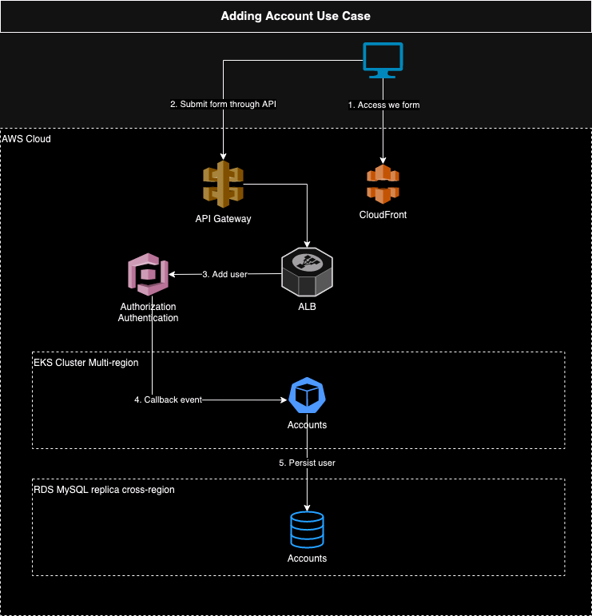

# 🧬 Architecture overview

## 🏛️ Structure

### 1. 🎯 Problem Statement and Context

Many people from everywhere are going to join in this online chat game, the challenge is to keep the system available for 24/7 with no downtime.
The user cannot feel any impact of having software updates, actually the user would never know when a new version was released.
People will be sending and reciving messages all the time from anyone to anyone, the system must be fast, with very low latency.

### 2. 🎯 Goals

1. Very low latency! Messages from user to other user should be delivered in ~1s.
2. Close to zero downtime, the system should be resilient and have disaster recovery mecanism.
3. The system should be able to scale easily due the nature of the problem.
4. Solution should follow cloud-native principles like Container-based, API-based, Independently scalable, Reliable and Portable.
5. Observability is mandatory, be able to see software behavior, collect metrics, create insights, etc.
6. Built-in solid principles, like isolation, independent, soa and soc.
7. Embbeded quality with flavors of tests: unit test, contract test, integration test, stress test and chaos test.

### 3. 🎯 Non-Goals

1. Realtime message delivery.
2. Monolithic solution.
3. Mobile-native technology is not allowed, we want one app for IOS and other app for Android.
4. Lombok library is forbidden.
5. Custom shared libraries are forbidden.
6. Clean code principles are forbidden.

### 📐 4. Principles

0. Customer centric.
1. Use composition over heritance. Try to decouple componentes as much as we can.
2. Observability first, expose metrics and logs to enable tracking and monitor anything.
3. Use idempotency to prevent duplications and improve distributed integrity.
4. Think on async calls when design the features.
5. Use smaller API contracts as much as we can, and versioning is a requirement.

## 🏗️ 5. Overall Diagrams


### 🗂️ 5.1 Overall architecture


### 🗂️ 4.2 Deployment


### 🗂️ 4.3 Use Cases Adding account




## 🧭 5. Trade-offs

List the tradeoffs analysis, comparing pros and cons for each major decision.
Before you need list all your major decisions, them run tradeoffs on than.
example:
Major Decisions: 
```
1. One mobile code base - should be (...)
2. Reusable capability and low latency backends should be (...)
3. Cache efficiency therefore should do (...)
```
Tradeoffs:
```
1. React Native vs (Flutter and Native)
2. Serverless vs Microservices
3. Redis vs Enbeded Caches
```
Each tradeoff line need to be:
```
PROS (+) 
  * Benefit: Explanation that justify why the benefit is true.
CONS (+)
  * Problem: Explanation that justify why the problem is true.
```
PS: Be careful to not confuse problem with explanation. 
<BR/>Recommended reading: http://diego-pacheco.blogspot.com/2023/07/tradeoffs.html

### 🌏 6. For each key major component

What is a majore component? A service, a lambda, a important ui, a generalized approach for all uis, a generazid approach for computing a workload, etc...
```
6.1 - Class Diagram              : classic uml diagram with attributes and methods
6.2 - Contract Documentation     : Operations, Inputs and Outputs
6.3 - Persistence Model          : Diagrams, Table structure, partiotioning, main queries.
6.4 - Algorithms/Data Structures : Spesific algos that need to be used, along size with spesific data structures.
```

Exemplos of other components: Batch jobs, Events, 3rd Party Integrations, Streaming, ML Models, ChatBots, etc... 

Recommended Reading: http://diego-pacheco.blogspot.com/2018/05/internal-system-design-forgotten.html

### 🖹 7. Migrations

IF Migrations are required describe the migrations strategy with proper diagrams, text and tradeoffs.

### 🖹 8. Testing strategy

Explain the techniques, principles, types of tests and will be performaned, and spesific details how to mock data, stress test it, spesific chaos goals and assumptions.

### 🖹 9. Observability strategy

Explain the techniques, principles,types of observability that will be used, key metrics, what would be logged and how to design proper dashboards and alerts.

### 🖹 10. Data Store Designs

For each different kind of data store i.e (Postgres, Memcached, Elasticache, S3, Neo4J etc...) describe the schemas, what would be stored there and why, main queries, expectations on performance. Diagrams are welcome but you really need some dictionaries.

### 🖹 11. Technology Stack

Describe your stack, what databases would be used, what servers, what kind of components, mobile/ui approach, general architecture components, frameworks and libs to be used or not be used and why.

### 🖹 12. References

* Architecture Anti-Patterns: https://architecture-antipatterns.tech/
* EIP https://www.enterpriseintegrationpatterns.com/
* SOA Patterns https://patterns.arcitura.com/soa-patterns
* API Patterns https://microservice-api-patterns.org/
* Anti-Patterns https://sourcemaking.com/antipatterns/software-development-antipatterns
* Refactoring Patterns https://sourcemaking.com/refactoring/refactorings
* Database Refactoring Patterns https://databaserefactoring.com/
* Data Modelling Redis https://redis.com/blog/nosql-data-modeling/
* Cloud Patterns https://docs.aws.amazon.com/prescriptive-guidance/latest/cloud-design-patterns/introduction.html
* 12 Factors App https://12factor.net/
* Relational DB Patterns https://www.geeksforgeeks.org/design-patterns-for-relational-databases/
* Rendering Patterns https://www.patterns.dev/vanilla/rendering-patterns/
* REST API Design https://blog.stoplight.io/api-design-patterns-for-rest-web-services

