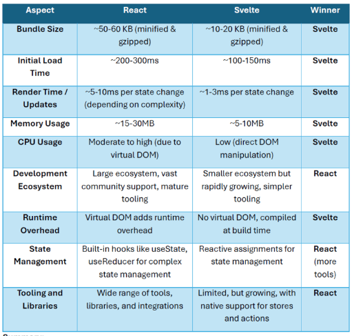
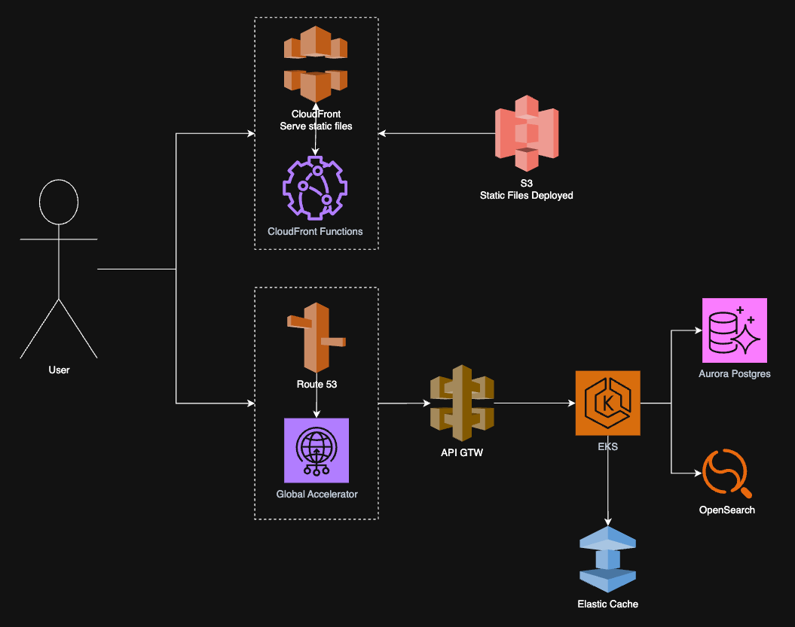
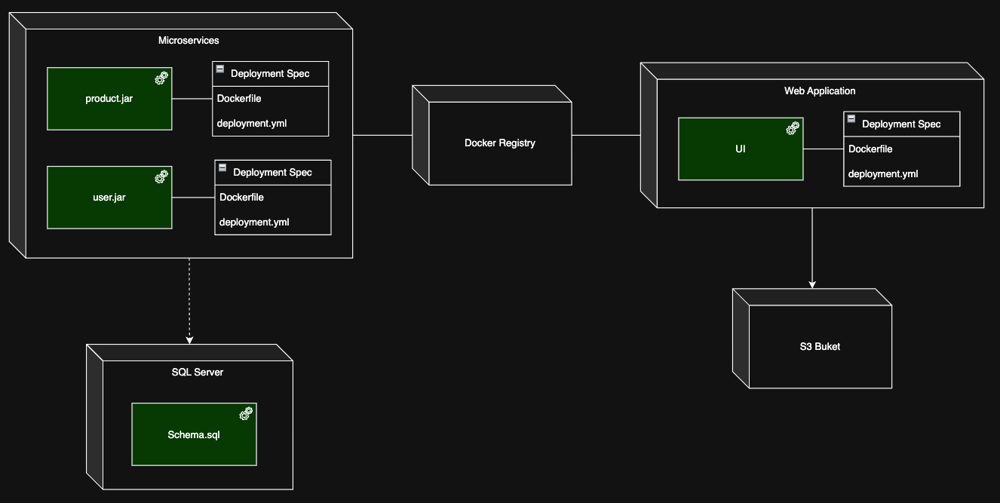
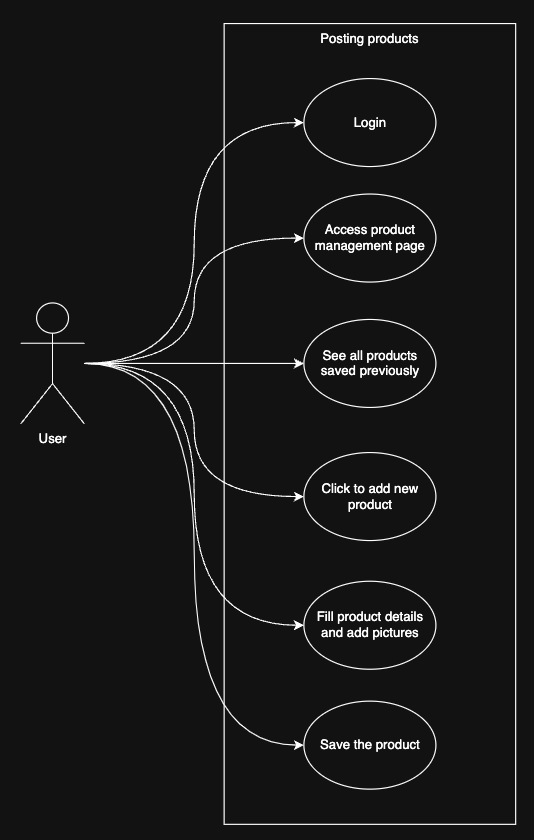
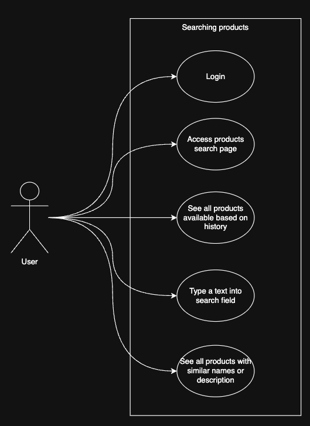
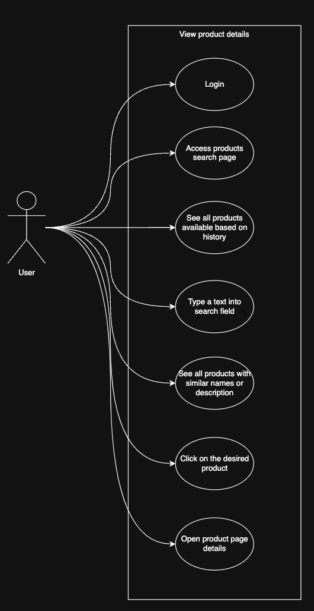
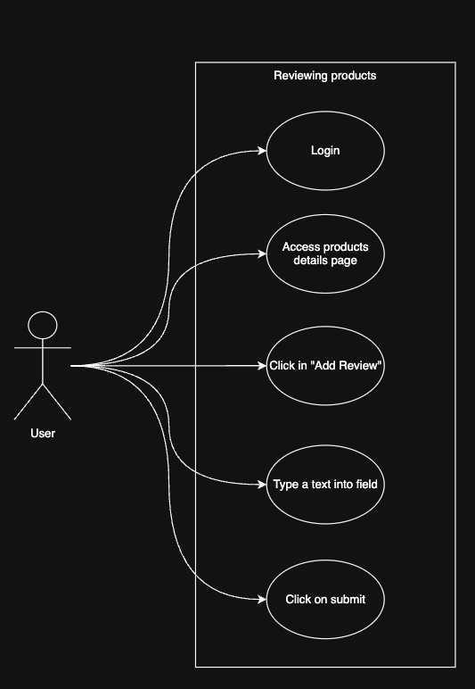
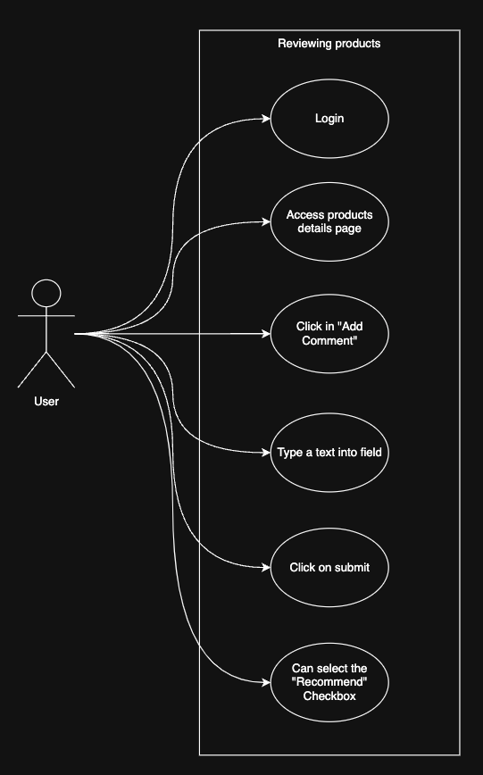
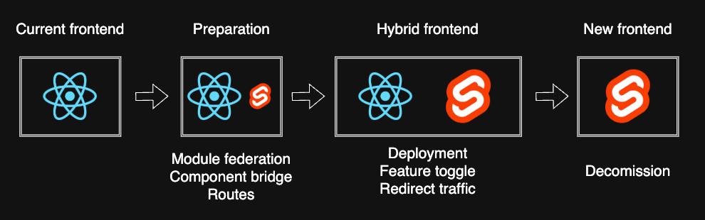

# 🧬 Architecture overview

# 🏛️ Structure

## 1 🎯 Problem Statement and Context

Latency Afficionados is a RETRO video game marketplace where users can sell RETRO video games and users can also buy such video games.

The platform is capable of:

- posting products
- search products
- view product descriptions
- rating products with review
- comments
- provide recommendation of products to users based on previews browsing
- sell/buy video games

### 1.1 Problem space
 Latency is a key concern for the CTO.

#### 1.1.1 First Problem
 The UI must be fast and the current React 16 implementation is not meeting the performance requirements.
 The goal is to find ways to speed up the rendering process and ensure that the UI is fast at all times.
 Could we upgrade and tune React to be faster enough?
 Could we use different technology to improve the performance of the UI?

**Option 1:**
 
 Upgrade React to the latest version and use React Hooks to improve the performance of the UI.

**Option 2:**
 
 Use a different technology like Svelte to improve the performance of the UI.
 Svelte is a new technology that compiles the code to vanilla JavaScript at build time,
 which means that there is no need for a virtual DOM and the code is faster to execute.
 Here is an performance comparison between React and Svelte:
 

 Svelte excels in terms of bundle size, initial load time, render time, memory usage, and CPU usage due to its
 compile-time optimizations and lack of virtual DOM.
 
 React offers a more mature ecosystem with a wide range of libraries, third-party tools, and a larger community,
 making it ideal for complex, large-scale applications.
 

**Websockets**
 Websockets are faster than traditional http protocol, here are the advantages:
 Persistent connection: Once established, the connection remains open, reducing overhead for subsequent messages.
 Full-duplex communication: Allows simultaneous two-way communication between client and server.
 Lower latency: After the initial handshake, data can be sent immediately without additional HTTP headers.
 Reduced server load: Fewer connections need to be opened and closed repeatedly.
 Real-time updates: Ideal for live data, chat applications, gaming, etc.
 Less data transfer: Smaller message sizes due to reduced header information.

#### 1.1.2 Second Problem
 The monolith is very old and needs to be migrated to Java Latest Stable.
 The monolith should be decomposed into smaller, more manageable services to improve maintainability and performance.
 Could use gradual migration strategy. First, could use tools to assist the migration like AI or OpenRewrite. Second, 
 start decomposing the monolith into microservices.
 Here is a decomposition propose:
- Product Service: Handles product listing, details, and search
- User Service: Manages user accounts and authentication
- Review Service: Handles product ratings and reviews
- Recommendation Service: Provides product recommendations
- Order Service: Manages the buying and selling process
- Comment Service: Handles user comments on products

## 2. 🎯 Goals
- Improve UI Performance
- Migrate and Modernize the Backend
- Enhance User Experience
- Maintain Scalability and Observability

## 3. 🎯 Non-Goals
- Support for Legacy Browsers
- Backward Compatibility with Java 1.4
- Custom Hardware Optimization

## 📐 4. Principles
1. Performance-First Design: Prioritize low-latency and high-performance solutions in both frontend and backend systems.
2. Incremental Migration: Ensure the migration from the monolith to microservices is gradual, minimizing disruption to users.
3. Observability: Expose metrics and logs to enable tracking and monitor latency.
4. User-Centric Optimization: Continuously optimize the system based on user behavior and feedback to enhance the overall experience.

# 🏗️ 5. Overall Diagrams

## 🗂️ 5.1 Overall architecture

## 🗂️ 5.2 Deployment

## 🗂️ 5.3 Use Cases

### Posting products

The user is capable of post products into the platform to sell it.

### Searching products

The user is capable of searching products in the platform to buy it.

### Viewing product descriptions

The user is capable of viewing product descriptions to understand the product better.

### Rating products with review

The user is capable of rating products with review to help other users to understand the product better.

### Comments and Recommend

The user is capable of commenting products to help other users to understand the product better.

The user is capable of providing recommendation of products to users based on previews browsing to help other users to understand the product better.

## 🧭 6. Trade-offs

### Major Decisions
1. Use Copilot Agent for code generation in latest Java version in order to modernize the monolith.
2. Use Svelte for frontend to improve UI performance and reduce latency.
3. Use WebSockets for real-time updates and faster communication.
   * Price drop alerts for wish listed games
   * Order status updates ("Seller has shipped your game")
   * Instantly update when rare retro games become available or sell out
   * Show "X people are viewing this item" counters in real-time
   * Display "Just sold!" notifications without page refresh
4. CloudFront for serving the static files.
5. Global Accelerator It is commonly used for web applications, APIs, gaming platforms, and any latency-sensitive or highly available global service.
   * Low-latency global access: Directs users to the nearest healthy AWS region or endpoint, reducing latency for global users.
   * High availability: Automatically reroutes traffic away from unhealthy endpoints to healthy ones, improving application uptime.
   * Disaster recovery: Supports failover between AWS Regions for business continuity.
   * Multi-region active-active architectures: Balances traffic across multiple AWS Regions for better performance and resilience.
   * DDoS protection: Leverages AWS Shield for built-in DDoS mitigation.
6. OpenSearch It would significantly improve the search experience in the marketplace while maintaining the performance standards.
7. Aurora Postgres works best as the primary transactional database.
8. PGsync to synchronize data from Aurora PostgreSQL to OpenSearch.

### Tradeoffs

1. Open-source.
  * ✅ PROS:
    * Benefits from community support and contributions.
  * 🚫 CONS:
    * Supporting and maintaining in house.

2. Svelte vs React
  * ✅ PROS:
    * Svelte compiles to vanilla JavaScript, resulting in smaller bundle sizes and faster execution.
    * No virtual DOM, leading to lower memory usage and CPU consumption.
  * 🚫 CONS:
    * Svelte has a smaller ecosystem compared to React, which may limit available libraries and tools.

3. WebSockets vs HTTP
  * ✅ PROS:
    * WebSockets provide lower latency and faster communication due to persistent connections.
    * Full-duplex communication allows for real-time updates.
  * 🚫 CONS:
    * Requires additional setup and management compared to traditional HTTP requests.
  * Benchmark comparison
    
    | Requests | Websocket total duration | HTTP total duration | Winner                |
    |----------|--------------------------|---------------------|-----------------------|
    | 1K       | 110 ms                   | 204 ms              | Websocket ~92% faster |
    | 10K      | 12123 ms                 | 19757 ms            | Websocket ~93% faster |
    | 100K     | 120914 ms                | 219011 ms           | Websocket ~94% faster |
    Source: https://github.com/codegik/websocket-benchmark

4. Non AWS alternative Cloudflare Workers
   * ✅ PROS Cloudflare Workers:
     * Extremely fast cold starts (<1ms)
     * Supports both JavaScript and WebAssembly
     * Larger memory limits (up to 128MB)
     * Can make external API calls
     * Extensive global network (275+ edge locations)
     * Built-in security features like Web Application Firewall
   * 🚫 CONS Cloudflare Workers:
     * No native Java/Kotlin support
     * Requires separate infrastructure if using AWS for other services
     * Requires Cloudflare-specific APIs
5. Global Accelerator
   * ✅ PROS:
     * Improves global application performance by routing users to the nearest healthy AWS endpoint.
     * Increases availability with automatic failover and health checks.
     * Supports multi-region architecture for resilience.
     * Provides built-in DDoS protection via AWS Shield.
     * Simplifies global traffic management with a single static IP.
   * 🚫 CONS:
     * Additional cost compared to standard AWS networking.
     * Adds another layer of infrastructure to manage.
     * Limited to AWS endpoints (not suitable for non-AWS resources).
     * May require changes to DNS and application architecture.
     * Some advanced routing features may not be as flexible as custom CDN or DNS solutions.

## 🌏 7. For each key major component

TBD

## 💾 8. Migrations

### ReactJS to Svelte Migration Strategy
For a smooth, incremental migration from React to Svelte while maintaining site functionality, we can use the "strangler fig pattern" approach.

The Strangler Fig Pattern is an incremental approach to system modernization where you gradually replace components of a legacy system with new implementations while maintaining functionality.

The pattern gets its name from the strangler fig vine that initially grows around a host tree, then gradually takes over until the original tree dies, leaving the vine in the same shape.

For this project, in summary involves:
- Create a facade - Build a layer of abstraction around the legacy system
- Replace incrementally - Gradually migrate functionality piece by piece behind the facade
- Redirect traffic - Route requests to new components as they're ready
- Decommission - Eventually remove the old system when all functionality has been replaced

#### Steps to Migrate from React to Svelte
1. Setup Frontend Architecture preparing current frontend ReactJS to Introduce Svelte
   - Update build configuration (Webpack/Vite) to support multiple frameworks.
   - Configure module resolution to handle both `.jsx` and `.svelte` files.
   - Set up shared dependencies and ensure no conflicts between React and Svelte ecosystems.
   - Establish routing strategy that can handle both React and Svelte components

2. Create a Component Bridge, this adapter lets React render Svelte components and vice versa.

3. Migration Path
   - Start with Leaf Components: Begin with simple, isolated components that have minimal dependencies
   - Create Component Parity: Build Svelte versions alongside React versions
   - Route-Based Migration: Migrate entire pages/routes together

4. Shared State Management: 
    - Create universal store compatible with both frameworks
    - Configure React and Svelte to use same universal store
    - Here is a POC proving that works: https://github.com/codegik/frontend/tree/master/share-universal-store

5. Deployment Strategy
   - Feature Toggles: Use feature flags to control which version (React/Svelte) is served
   - Shadowed Testing: Deploy Svelte components to production but only activate for test users
   - Gradual Rollout: Increase percentage of users seeing Svelte components based on metrics
   - Performance Monitoring: Compare metrics between React and Svelte implementations

This strategy allows to migrate your RETRO game marketplace incrementally while maintaining site functionality and gradually benefiting from Svelte's performance advantages.

## 🧪 9. Testing strategy

- Before creating new tests, we should first ensure that the existing tests are running and passing.
  - Increase the coverage of existing integration/contract tests to 80% or more.
  - We should not start the migration without having a good coverage of the existing contracts.
  - It will reduce the chances of breaking existing functionality during the migration.
  - The testes must run in developer environments and CI/CD pipeline.

- Frontend Tests
  - Svelte component rendering tests with focus on performance metrics.
  - Client-side state management tests.
  - WebSocket client implementation tests.

- Contract tests
  - Test API contracts between decomposed microservices (Product, User, Review, Order, etc.).
  - Verify WebSocket message formats and protocols.
  - Validate data synchronization contracts between PostgreSQL and OpenSearch.

- Integration tests
  - Try to cover most of the scenarios, e.g. Uploading file, deleting file, searching file, updating metadata, etc.
  - Test WebSocket real-time communication flows.
  - Run in isolated environments before production deployment.

- Infra tests 
  - Verify PGsync data synchronization between Aurora and OpenSearch.
  - Test CloudFront edge caching effectiveness.
  - Validate Global Accelerator routing behavior.
  
- Performance tests
  - Use Gatling to simulate the user behavior and check the system's performance.
  - Test search latency using OpenSearch under various query patterns.
  - Measure database query performance under load
  - Measure UI rendering time across device types
  - Benchmark WebSocket vs HTTP performance in real usage scenarios
  - Track CDN cache hit/miss ratios  
  - Execute in staging environment with production-like conditions

- Chaos tests
  - Simulate AWS region failures to test Global Accelerator failover
  - Test WebSocket reconnection strategies during network disruptions
  - Inject latency between services to identify performance bottlenecks
  - Verify system behavior during PGsync failures
  - Execute in isolated production environment during low-traffic periods

## 👀 10. Observability strategy

Observability-based testing in production (also called "testing in production" or "production testing") uses monitoring, logging, and tracing data to validate system behavior after deployment. 

There will be an event notifier that is going to log all operations during the migration.

There will be a dashboard to expose the migration progress, metrics and performance.

There will be alerts to notify the team about any issue during the migration.
 
Here are the key approaches:

- **Synthetic Monitoring**: Collect features metrics (latency, counters, etc) continuously to validate critical user journeys.

- **Real User Monitoring**: Track actual user interactions and performance metrics.
  - Svelte component render times
  - WebSocket connection success rates
  - Search result relevance and speed
  - Page load times across different regions
- 
- **Error Rate Monitoring**: Set up alerts for anomalies in.
  - WebSocket connection failures
  - OpenSearch query timeouts
  - Aurora PostgreSQL connection pool exhaustion
  - CloudFront 5xx errors

- **Business Metrics Validation**: Monitor business KPIs to detect regressions.
  - Product listing success rate
  - Search-to-purchase conversion
  - User session duration
  - Revenue per visitor

## 👌 11. Technology Stack

### Frontend
- **Framework**: Svelte (migrating from React 16)
- **Build Tool**: Vite
- **State Management**: Universal Store (compatible with both React and Svelte)
- **Real-time Communication**: WebSocket API

### Backend
- **Primary Language**: Java (Latest Stable Version)
- **Framework**: Spring Boot
- **Build Tool**: Maven
- **Migration Assistant**: GitHub Copilot

### Database & Search
- **Primary Database**: Aurora PostgreSQL
- **Search Engine**: OpenSearch
- **Data Synchronization**: PGsync

### Observability & Monitoring
- **Metrics Collection**: CloudWatch
- **Logging**: CloudWatch Logs
- **Synthetic Monitoring**: Custom Kotlin/Java components
- **Real User Monitoring**: Custom implementation

## 👥 12. References

* Architecture Anti-Patterns: https://architecture-antipatterns.tech/
* EIP https://www.enterpriseintegrationpatterns.com/
* SOA Patterns https://patterns.arcitura.com/soa-patterns
* API Patterns https://microservice-api-patterns.org/
* Anti-Patterns https://sourcemaking.com/antipatterns/software-development-antipatterns
* Refactoring Patterns https://sourcemaking.com/refactoring/refactorings
* Database Refactoring Patterns https://databaserefactoring.com/
* Data Modelling Redis https://redis.com/blog/nosql-data-modeling/
* Cloud Patterns https://docs.aws.amazon.com/prescriptive-guidance/latest/cloud-design-patterns/introduction.html
* 12 Factors App https://12factor.net/
* Relational DB Patterns https://www.geeksforgeeks.org/design-patterns-for-relational-databases/
* Rendering Patterns https://www.patterns.dev/vanilla/rendering-patterns/
* REST API Design https://blog.stoplight.io/api-design-patterns-for-rest-web-services

# TODO
1. [X] Docker registry - ECR
2. [X] Define LLM
3. [X] Uses cases for websocket
4. [X] Benchmark for websocket
5. [X] PGsync option
6. [X] Use case cloud front function
7. [X] Store concept 
8. [X] Bundler module federation (don't need to use module federation)
9. [X] Observability tests pos prod