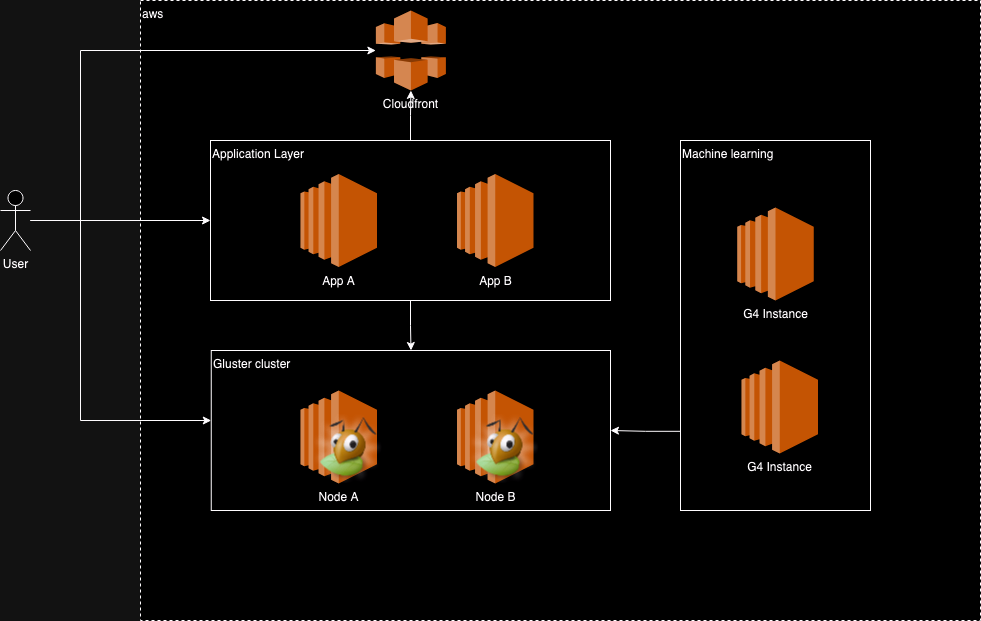
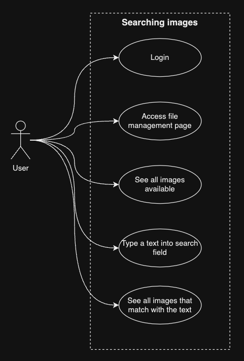
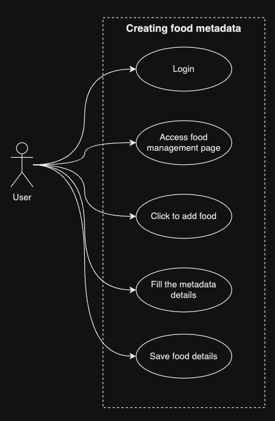
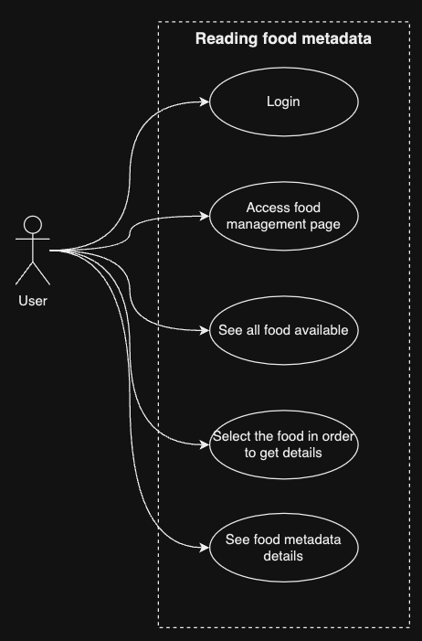
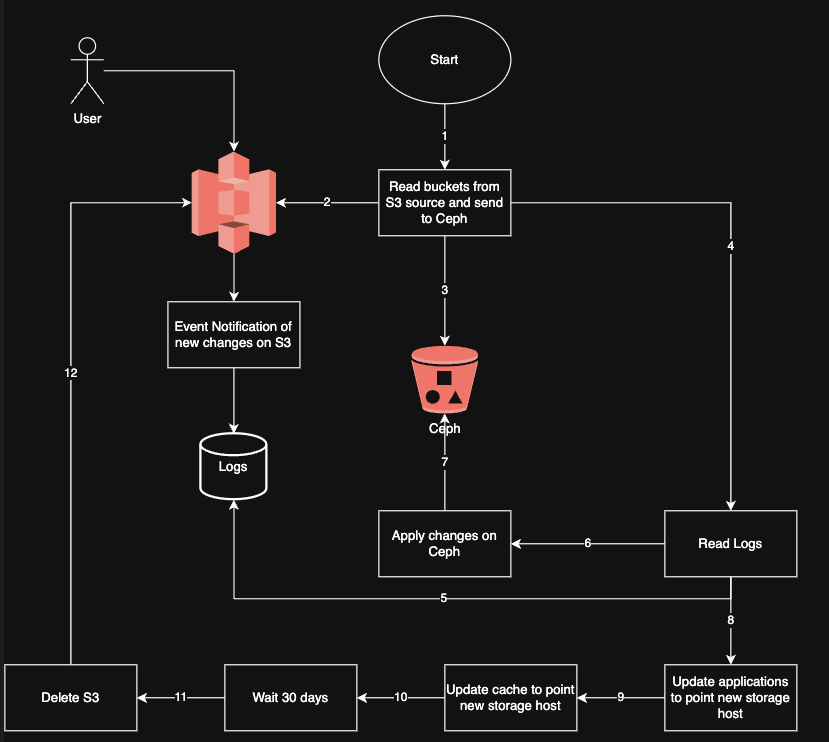

# 🧬 Architecture overview

## 🏛️ Structure

### 1. 🎯 Problem Statement and Context

Food-Co is a food chain, and they're spending too much money using S3 as the main storage. 
They need to reduce the costs, but this must not impact the user experience. 
It should be a smooth migration.


#### Problem space

##### Option 1: Change S3 storage class
- Use S3 if you need low latency or frequent access to your data. Use S3 Glacier for low storage cost, and you do not require millisecond access to your data.
- Both S3 and Glacier are designed for durability of 99.999999999% of objects across multiple Availability Zones.
- **S3 can be used to host static web content, while Glacier cannot.**
- You can run analytics and querying on S3 and Glacier.
- You can configure a life cycle policy for your S3 objects to automatically transfer them to Glacier. You can also upload objects directly to either S3 or Glacier.
- Objects stored in S3 have a minimum storage duration of 30 days (except for S3 Standard). Objects that are archived to Glacier have a minimum 90 days of storage. Objects that are deleted, overwritten, or transitioned to a different storage class before the minimum duration will incur the normal usage charge plus a pro-rated request charge for the remainder of the minimum storage duration.
- We don't need extra refactoring on existing services, we have full compatibility with S3 api.
- We also should have better compressing strategy to reduce bandwidth and storage.

| Storage class or tier                                                  | Expedited            | Standard            | Standard (without Batch) | Bulk            |
|------------------------------------------------------------------------|----------------------|---------------------|--------------------------|-----------------|
| S3 Glacier Flexible Retrieval or S3 Intelligent-Tiering Archive Access | 1–5 minutes          | Minutes–5 hours     | 3–5 hours                | 5–12 hours      |
| S3 Glacier Deep Archive or S3 Intelligent-Tiering Deep Archive Access  | Not available        | 9-12 hours          | Within 12 hours          | Within 48 hours |
|                                                                        |                      |                     |                          |                 |
| Prices                                                                 | $10.00 - 1k requests | $0.05 - 1k requests | $0.05 - 1k requests      | N/A             |


##### Option 2: Use different provider
- ✅ PROS:
    - Low cost of storage.
    - Lower bandwidth costs.
    - Simpler pricing structure.
    - Free egress to CDN. (most cases)
    - S3 Compatible API.
- 🚫 CONS:
    - Lack of connectedness with native services.
    - No event handler to trigger functions. (most cases)
    - Limited number of regions. (some cases)


##### Option 3: Create a custom proxy
- Create a service in front of S3 and other providers. It should request data on a pool of storage providers, if the data doesn't exists on provider A, try get data on provider B, and so on.
- Create a policy to move the data based on access frequent.
    - Frequently accessed files should lives on S3.
    - Files accessed from time to time should lives on secondary provider.
    - Rarely accessed files should lives on cold storage data.


##### Option 4: Use open source tool (Ceph)
- ✅ PROS:
    - Low cost of storage.
    - Open-source: Ceph allows full access to its codebase, promoting maximum customization and adaptability to your specific needs.
- 🚫 CONS:
    - Supporting and maintaining in house.

##### Option 5: Mix of tools

**For image store we can use CDN CloudFront.**
- ✅ PROS:
    - Server side Latency: We can reduce the latency of transferring files to CloudFront since the application is running on AWS.
    - Client side Latency: Faster download speeds and lower latency for your files will result in a significant improvement in customer experience.
- 🚫 CONS:
    - Pricing: High cost at scale, CloudFront pricing is pay-per-use.

**For metadata, we could use open source tool Gluster or Ceph.**
- ✅ PROS:
    - Low cost of storage.
    - Open-source: Gluster/Ceph allows full access to its codebase, promoting maximum customization and adaptability to your specific needs.
    - Latency: The file storage could be installed on an EC2 instance, witch will reduce the latenc£y if compared to using other file storage cloud provider.
- 🚫 CONS:
    - Supporting and maintaining in house.

**For machine learning we could use XPTO TBD.**

##### Use cases & Strategies

We're going to migrate the files from S3 to Gluster by batch process. Once the files are copied, we can remove from S3.

During the copy period, the files will coexist in both places (S3 and Gluster).

After finish the migration, we can point the applications to the new Image Store server.

| Use case                         | Strategy                                                                                                    |
|:---------------------------------|:------------------------------------------------------------------------------------------------------------|
| Consuming files from Image Store | We're going to use open source tool as source (Ceph) of true for images and Nginx as image cache.           |
|                                  | Accessed files will be cached on Nginx directory, and will create a policy to delete older files.           |
|                                  | Users will download the images directly from Nginx.                                                         |
|                                  | Existing applications will consume images from there also.                                                  |
| Adding files to Image Store      | Ceph has API compatible with S3, so existing application would be uploading files to the server as usual.   |
|                                  | Once the file is accessed, it will be cached on Nginx.                                                      |
| Food metadata persistence        | We can have a second Ceph custer to handle only metadata, but we don't need Nginx on front.                 |
|                                  | Users will be able to query or persist food metadata.                                                       |
| Predict consumer order           | We're going to replicate necessary data to Aurora in order to exposes ML models as SQL functions.           |
|                                  | Aurora can call SageMaker or Bedrock for a wide variety of ML algorithms including generative AI.           |
|                                  | Company can predict user orders.                                                                            |
| Tracking existing order          | We will persist order data into Aurora DB, so user could track and see all related data to its orders.      |
| Payment                          | We will persist order data into Aurora DB, so user could see history of payments and payment configuration. |
|                                  |                                                                                                             |


| Reducing costs strategy                                                                                                                                                   |
|:--------------------------------------------------------------------------------------------------------------------------------------------------------------------------|
| Leverages EC2 hardware environment, making it a cost-effective solution without needing any expensive and extra hardware.                                                 | 
| Data that is accessed frequently can be stored in pools with higher performance settings, whereas archival data can be stored in pools configured for lower-cost storage. |
| Ceph storage pools help control costs is through their inherent data distribution and redundancy mechanisms.                                                              |


### 2. 🎯 Goals

- Reduce storage costs.
- Keep data available for long period of time.
- Smooth migration.
- Caching.
- On demand migration and batch migration.
- Refactor some services in order to consume data from different source, but not changing the existing contracts.

### 3. 🎯 Non-Goals

- API contract updates. 
- Slow down existing system during migration.


### 📐 4. Principles

1. Customer centric.
2. Data availability and integrity. Users should not notice the migration.
3. Observability, expose metrics and logs to enable tracking and monitor anything.
4. Cost-effective, reduce costs and keep the system available.

## 🏗️ 5. Overall Diagrams

### 🗂️ 5.1 Overall architecture



### 🗂️ 5.2 Deployment


### 🗂️ 5.3 Use Cases 

#### Image Store




#### Creating/Reading Food Metadata






## 🧭 6. Trade-offs

### Major Decisions
1. Use Ceph for low storage cost instead of S3, and Ceph has a S3 compatible API.
2. Use Nginx for caching files in front of Ceph.
3. Use SageMaker or Bedrock for a wide variety of ML algorithms including generative AI.

### Tradeoffs
1. Cost of storage.
   - ✅ PROS:
      * Comparing to S3, Ceph has a lower cost of storage.
      * Calculating usage of 200TB of storage monthly, S3 would cost \$18,689.62, while Ceph would cost \$14,200.46.
      * https://calculator.aws/#/estimate?id=2abf04a1b2dc2ced3c0ea2b95ed7365833f4f8b3
      * https://calculator.aws/#/estimate?id=8faccdff7a53c79bac92ecaa1758f6a2f99218e4
   - 🚫 CONS:
      * Lack of connectedness with native services.
  
2. Open-source.
  - ✅ PROS:
    * Ceph allows full access to its codebase, promoting maximum customization and adaptability to your specific needs.
  - 🚫 CONS:
    * Supporting and maintaining in house.


## 🌏 7. For each key major component

### 7.1 Image Store

This is an API to store images and thumbnails.

It's going to automatically create a thumbnail for each image uploaded.

The upload process will use multipart/form-data and compression.


#### Request
```
PUT https://{ceph-bucket-name}.{ceph-storage}/{object-key}?X-Amz-Algorithm=AWS4-HMAC-SHA256&X-Amz-Credential={access-key-id}%2F20231015%2Fus-east-1%2Fs3%2Faws4_request&X-Amz-Date=20231015T000000Z&X-Amz-Expires=86400&X-Amz-SignedHeaders=host&X-Amz-Signature={signature}" \
  -H "Content-Type: multipart/form-data; boundary={boundary}" \
  -F "file=@path/to/your/file"
```

| Field            | Description                                                            |
|------------------|------------------------------------------------------------------------|
| ceph-storage     | The hostname of the Storage                                            |
| ceph-bucket-name | The name of the bucket where you want to store your object             |   
| object-key       | The key of the object you want to store                                |
| access-key-id    | The access key ID that you received when you created your AWS account  |
| signature        | The signature you created                                              |
| boundary         | The boundary string that you used to separate the parts of the request |

#### Response
```
HTTP/1.1 200 OK
Content-Type: application/octet-stream
Content-Length: 12345
Last-Modified: Sun, 15 Oct 2023 12:34:56 GMT
ETag: "9b2cf535f27731c974343645a3985328"
x-amz-request-id: 1234567890ABCDEF
x-amz-id-2: 0987654321FEDCBA
```

| HTTP Status               | Description                                    |
|---------------------------|------------------------------------------------|
| 200 OK                    | The object was successfully created or updated |
| 400 Bad Request           | The request was malformed or invalid           |   
| 403 Forbidden             | The request was not authorized                 |
| 404 Not Found             | The specified bucket does not exist            |
| 500 Internal Server Error | An error occurred on the server side           |

| HTTP Headers     | Description                                 |
|------------------|---------------------------------------------|
| ETag             | The entity tag for the uploaded object      |
| x-amz-request-id | The request ID for tracking purposes        |
| x-amz-id-2       | Additional request ID for tracking purposes |


### 7.2 Search Images

This is an API to search images on the storage.

It's going to use a cache to store the most accessed images.

#### Request
```
GET "https://{ceph-storage}/{bucket-name}?prefix={prefix}" \
  -H "Authorization: AWS {access-key}:secret-key"
```

| Field            | Description                                                        |
|------------------|--------------------------------------------------------------------|
| ceph-storage     | The hostname of the Storage                                        |
| ceph-bucket-name | The name of the bucket where you want to store your object         |   
| prefix           | The text to search files                                           |
| access-key       | The access key that you received when you created your AWS account |
| secret-key       | The secret key that you received when you created your AWS account |

#### Response
```
{
  "ListBucketResult": {
    "Name": "bucket-name",
    "Prefix": "photos/",
    "Marker": "",
    "MaxKeys": 1000,
    "IsTruncated": false,
    "Contents": [
      {
        "Key": "photos/photo1.jpg",
        "LastModified": "2023-10-15T12:34:56.000Z",
        "ETag": "9b2cf535f27731c974343645a3985328",
        "Size": 12345,
        "StorageClass": "STANDARD"
      },
      {
        "Key": "photos/photo2.jpg",
        "LastModified": "2023-10-14T11:22:33.000Z",
        "ETag": "9b2cf535f27731c974343645a3985328",
        "Size": 67890,
        "StorageClass": "STANDARD"
      }
    ]
  }
}
```

### 7.3 Download files

#### Request
```
GET "https://{ceph-storage}/{ceph-bucket-name}/{object-key}" \
  -H "Authorization: AWS {access-key}:{secret-key}"
```

| Field            | Description                                                        |
|------------------|--------------------------------------------------------------------|
| ceph-storage     | The hostname of the Storage                                        |
| ceph-bucket-name | The name of the bucket where you want to store your object         |   
| object-key       | The key of the object you want to download                         |
| access-key       | The access key that you received when you created your AWS account |
| secret-key       | The secret key that you received when you created your AWS account |

#### Response
```
HTTP/1.1 200 OK
Content-Type: application/octet-stream
Content-Length: 12345
Last-Modified: Sun, 15 Oct 2023 12:34:56 GMT
ETag: "9b2cf535f27731c974343645a3985328"
x-amz-request-id: 1234567890ABCDEF
x-amz-id-2: 0987654321FEDCBA
```

| HTTP Status               | Description                                    |
|---------------------------|------------------------------------------------|
| 200 OK                    | The object was successfully created or updated |
| 400 Bad Request           | The request was malformed or invalid           |   
| 403 Forbidden             | The request was not authorized                 |
| 404 Not Found             | The specified bucket does not exist            |
| 500 Internal Server Error | An error occurred on the server side           |

| HTTP Headers     | Description                                 |
|------------------|---------------------------------------------|
| ETag             | The entity tag for the uploaded object      |
| x-amz-request-id | The request ID for tracking purposes        |
| x-amz-id-2       | Additional request ID for tracking purposes |


### 💾 8. Migrations

We can create a automation to migrate data from S3 to Ceph.



- Create event notification on S3 to trigger a lambda function that will log the operation.
  - During the data sync, S3 will be the source of truth and the users will be able to access the data.
  - The user can upload or delete files to s3, so the lamda will log the operation history.
- Sync the data from S3 to Ceph.
- Once sync has finished, the automation will read the log and apply the operations to Ceph.
- Update the application to point to the new storage.
- Update the cache to point to the new storage.
- Keep the data in S3 for a period like 15 days, and then delete the data from S3.


### 🧪 9. Testing strategy

- Contract tests
  - It will reduce the chances of one contract change breaks any consumer.
  - It will be running in developer machine and CI/CD pipeline.

- Integration tests
  - Try to cover most of the scenarios, e.g. Uploading file, deleting file, searching file, updating metadata, etc.  
  - It will be running in developer machine and CI/CD pipeline right after the build.

- Performance tests
  - Use Gatling to simulate the user behavior and check the system's performance.
  - It will be running in CI/CD pipeline and pointing to production.

- Chaos tests
  - Test the system's ability to withstand turbulent and unexpected conditions like network latency, server failure, etc.
  - It will be running in CI/CD pipeline and pointing to production.


### 👀 10. Observability strategy

[//]: # (Explain the techniques, principles,types of observability that will be used, key metrics, what would be logged and how to design proper dashboards and alerts.)

- There will be an event notifier that is going to log all operations during the migration.
- There will be a dashboard to expose the migration progress, metrics and performance.
- There will be alerts to notify the team about any issue during the migration.


### 👌 11. Technology Stack

- Ceph
- Nginx
- Cloudfront
- G4 Instances

### 👥 12. References

* Architecture Anti-Patterns: https://architecture-antipatterns.tech/
* EIP https://www.enterpriseintegrationpatterns.com/
* SOA Patterns https://patterns.arcitura.com/soa-patterns
* API Patterns https://microservice-api-patterns.org/
* Anti-Patterns https://sourcemaking.com/antipatterns/software-development-antipatterns
* Refactoring Patterns https://sourcemaking.com/refactoring/refactorings
* Database Refactoring Patterns https://databaserefactoring.com/
* Data Modelling Redis https://redis.com/blog/nosql-data-modeling/
* Cloud Patterns https://docs.aws.amazon.com/prescriptive-guidance/latest/cloud-design-patterns/introduction.html
* 12 Factors App https://12factor.net/
* Relational DB Patterns https://www.geeksforgeeks.org/design-patterns-for-relational-databases/
* Rendering Patterns https://www.patterns.dev/vanilla/rendering-patterns/
* REST API Design https://blog.stoplight.io/api-design-patterns-for-rest-web-services
