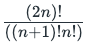
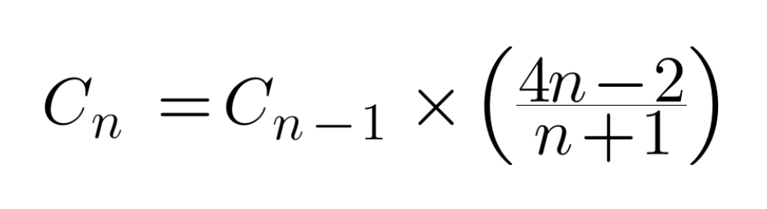

# Program for nth Catalan Number

## Description

Catalan numbers are defined as a mathematical sequence that consists of positive integers, 
which can be used to find the number of possibilities of various combinations.  

The `nth` term in the sequence denoted `Cn`, is found in the following formula: 

The first few Catalan numbers for n = 0, 1, 2, 3, 4, 5… are: 1, 1, 2, 5, 14, 42, 132, 429, 1430, 4862, ...  so on.

## Example 1
```
Input: n = 6
Output: 132
Explanation: C(6)=C(0)C(5)+C(1)C(4)+C(2)C(3)+C(3)C(2)+C(4)C(1)+C(5)C(0)=132
```

## Example 2
```
Input: n = 8
Output: 1430
Explanation: C(8)=C(0)C(7)+C(1)C(6)+C(2)C(5)+C(3)C(4)+C(4)C(3)+C(5)C(2)+C(6)C(1)+C(7)C(0)=1430
```

## Example 3
```
Input: n = 5
Output: 42
Explanation: C(5)=C(0)C(4)+C(1)C(3)+C(2)C(2)+C(3)C(1)+C(4)C(0)=42
```

This formula can be further simplified to express the nth Catalan Number in the terms of (n-1)th Catalan Number, 


