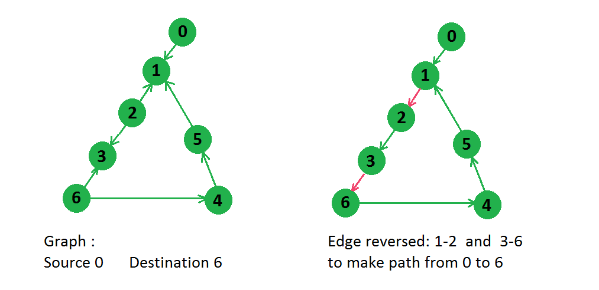
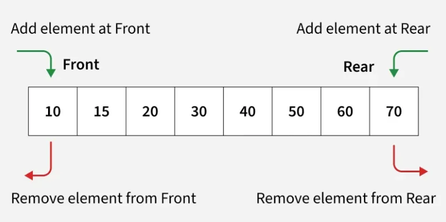

# Kotlin Challenge - Minimum Edges Reverse Challenge

## Minimum edges to reverse to make path from a source to a destination
Given a directed graph with n nodes and m edges. A source node and a destination node are also given, we need to find how many edges we need to reverse in order to make at least 1 path from the source node to the destination node.

Note: In case there is no way then return -1.

### Example


```
Input: n = 7, src = 0, dst = 6
edges[][] = [ [0, 1], [2, 1], [2, 3], [6, 3], [6, 4], [4, 5], [5, 1] ]
Output: 2

Explanation: In above graph there are two paths from node 0 to node 6:
0 -> 1 -> 2 -> 3 -> 6
0 -> 1 -> 5 -> 4 -> 6

For the first path, two edges need to be reversed, and for second path, three edges need to be reversed, thus the minimum edges to be reversed is 2.

Input: n = 4, src = 1, dst = 4
edges[][] = [ [1, 2], [2, 3], [3, 4] ]
Output: 0

Explanation: One path already exists between node 1 to 4: 1 -> 2 -> 3 -> 4. Thus no nodes need to be reversed.

```


## What is BFS?
BFS is a graph traversal algorithm that explores vertices level by level - visiting all neighbors at the current depth before moving to the next depth level.


## How BFS works:
- Start from a source vertex  
- Visit all its immediate neighbors (distance 1)
- Then visit all neighbors of those neighbors (distance 2)
- Continue until all reachable vertices are visited

## Dequeue

