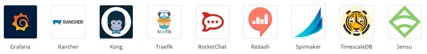

# Prometheus

## 1. Store metrics and performance data
## 2. Pulling approach
## 3. Time series DB
## 4. Companies using


## 5. Integrations


## 6. Advantages
### - Easy to setup and create alerts
### - Multi-dimensional data model
### - No dependency on distributed storage

## 7. Drawbacks
### - Requires multiple tools to compensate the poor UI
### - Only for metrics
### - Written in Go

# Demo stack = Kotlin + Spring-boot + Prometheus

## Metrics
### - jvm_memory_used_bytes
### - http_server_requests_seconds_count
### - http_server_requests_seconds_count{uri="/hello"}
### - http_server_requests_seconds_count{uri="/hello"}[1m]
### - rate(http_server_requests_seconds_count{uri="/hello"}[1h])
### - system_cpu_usage
### - rate(system_cpu_usage[1m])


### Requirements
- Java 17
- Gradle
- Docker

### Running and testing

1 - Start everything: spring-boot app + prometheus
```
./start.sh
```

2 - Shutting down the application
```
./app-stop.sh
```

3 - Start the application
```
./app-start.sh
```

4 - Stop everything
```
./stop.sh
```
