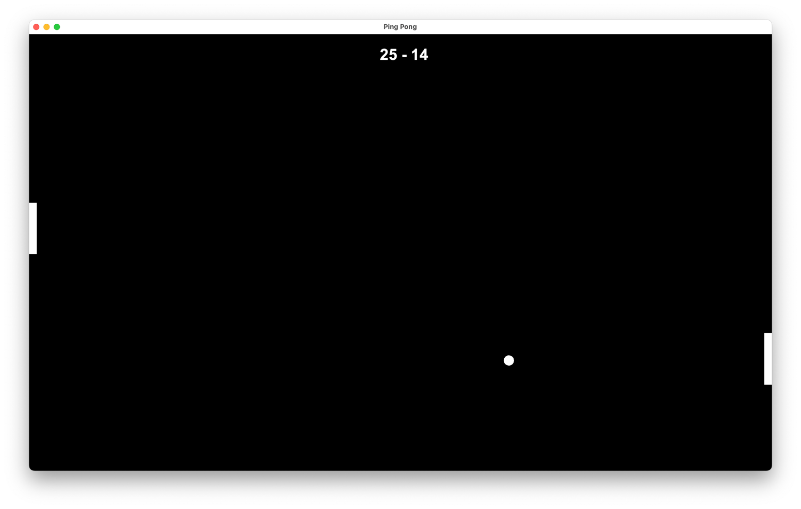

# Scala3 - PingPong Game
This is a simple PingPong game implemented in Scala 3 using the Scala Swing library. 

The game features a paddle controlled by the player and a ball that bounces around the screen.




## Running the Game
``` 
sbt run
```