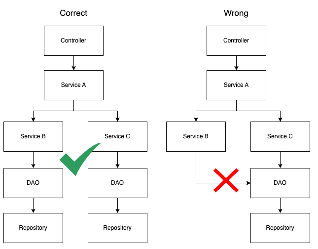

# Scala + Springboot = Interoperability

This project is using Scala + Springboot. It is a simple project to demonstrate the interoperability between Scala and Java.

## Requirements
- Java 21
- SBT 1.10.5
- Scala 3.6.2

## Challenge 1: Scala Collections over Java Collections

Imagine that you want to avoid the use of Java Collections in your Scala codebase. 
There are many reasons for that, but one of the main reasons is that Scala Collections are more powerful and have more features than Java Collections.
Specially if we're seeking for Immutability.

Springboot is a Java Library and by default, it uses Java Collections. Example: `ArrayList`, `HashMap`, `HashSet`, etc.

The `Repository` interface is returning `Iterable`, which is a Java Interface. 

So, here are some questions that we need to answer: 
  - How can we use Scala Collections in a Springboot project?
  - How can we create a Repository that returns Scala Collections?

## Challenge 1: Engineer Design Solution

### How to use Scala Collections in a Springboot project?

We can use Scala Collections in a Springboot project by creating layers of abstraction.

For example, we can create a DAO layer between Service layer and Repository layer. This DAO layer can convert Java Collections to Scala Collections and vice versa.

The service layer should not access the Repository directly. Instead, it should access the DAO layer.


We can do the same approach in other edge layers like Controller. If you need to keep the contracts compatible with Java applications, you can convert Scala Collections to Java Collections in the Controller layer.

One last thing to mention is the services can depend each other, so It's important to keep in mind that each service should access only the correspondent DAO layer, and cannot access DAO of the other service.
Believe me, this is a good practice specially when your application grows. This approach can save lives.



### How can we create a Repository that returns Scala Collections?

You can't. Simple as that. This example is using `scala.List` and doesn't work.

```scala 3
@Repository
trait UserRepository extends CrudRepository[User, String] {
  def findByName(name: String): List[User]
}
```

The problem here is Springboot will throw an Exception when try to convert the `java.lang.Iterable` to ` scala.List`, because Springboot doesn't recognize as a valid Java Type.

The solution is to use Java Collections like these examples:

```scala 3
@Repository
trait UserRepository extends CrudRepository[User, String] {
  def findByName(name: String): java.util.List[User]
  // OR
  def findByName(name: String): java.lang.Iterable[User]
}
```

And now the DAO layer comes in and do the explicit conversion.

```scala 3
import scala.jdk.CollectionConverters.*

@Component
class UserDao @Autowired() (
  private val userRepository: UserRepository
) {
  def findByName(name: String): List[User] = {
    userRepository.findByName(name).asScala.toList
  }
}
```

The good news is the method `asScala` is not converting the whole List into a new List, It's only wrapping the iterator. 
So, it's a very efficient way to convert Java Collections to Scala Collections.

And the method `toList` is actually creating a new immutable List. Which is good, because we're in favor of immutability.


## Challenge 2: Spring JDBC + Scala case classes

Another challenge is to work with Spring JDBC and Scala. Mapping entities using case classes could be very painful.

First issue is annotating the case class fields. If you try the conventional way like this, it won't work.

```scala 3
case class User(
  @Id
  id: UUID = null
)
```

The problem here is because the annotation `@Id` is targeting the get method, not the field itself. 

Spring JDBC uses reflection to access the fields, so it's not able to access the annotation in the get method.

## Challenge 2: Engineer Design Solution

So, the solution is combine Spring Data annotations with Scala annotation `@field`. For example:

```scala 3
case class User(
  @(Id @field) id: UUID = null
)
```

One of the main benefit is that you can use `copy` method from case classes.

## Challenge 3: Spring JDBC + ID Generation

Here is a good reference to start: https://spring.io/blog/2021/09/09/spring-data-jdbc-how-to-use-custom-id-generation.
There are some options to generate the ID, All of them lucks good. 
But for my case, I'd prefer explicit implementation to things running in an obscurity way like interceptor or event listeners.

Nowadays, the most common way to generate ID is using UUID.
Spring JDBC implementation is expecting that the ID is not set when you're trying to save a new entity.
And it's expecting that the ID is set when you're trying to update an entity.

The problem is when you're trying to save a new entity with an ID set, Spring JDBC will try to perform an update, because the ID is already set. However, because the aggregate is actually new, the update statement affects zero rows and Spring JDBC throws an exception.

## Challenge 3: Engineer Design Solution

Here is the solution where we can use the `@Id` annotation and let the Database generate the ID for you.
The idea is to delegate the UUID generation to the Database. Then we don't need extra code to generate the UUID and handle Spring JDBC issues.

Basically, what we need to do is create a table with a default value for the ID column.

```sql
create table users (
    id uuid not null default uuid() primary key,
    name varchar(300),
    email varchar(300)
);
```

And then we could map the entity like this:
```scala 3
@Table(name = "USERS")
case class User(
   @(Id @field) id: UUID = null,
   @(Column @field) name: String = null,
   @(Column @field) email: String = null,
)
```

And that's it. The Database will generate the ID for you.

# Conclusion

Scala and Springboot can work together. But you need to be aware of some caveats.

The interoperability between Scala and Java is not perfect, but it's possible. Sometimes you need to create layers of abstraction to make it work.

The proposed solutions works like a charm, please take a look in the codebase to see the full implementation.


