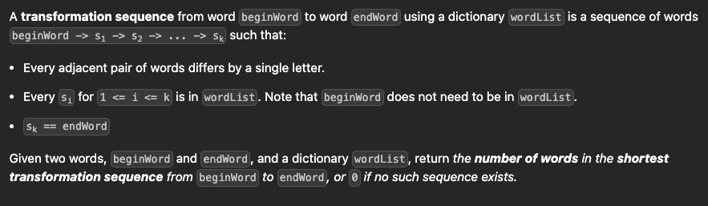

# TS Challenge - Word Ladder


## Example 1
```
Input: beginWord = "hit", endWord = "cog", wordList = ["hot","dot","dog","lot","log","cog"]
Output: 5
Explanation: One shortest transformation sequence is "hit" -> "hot" -> "dot" -> "dog" -> cog", which is 5 words long.
```

## Example 2
``` 
Input: beginWord = "hit", endWord = "cog", wordList = ["hot","dot","dog","lot","log"]
Output: 0
Explanation: The endWord "cog" is not in wordList, therefore there is no valid transformation sequence.
```